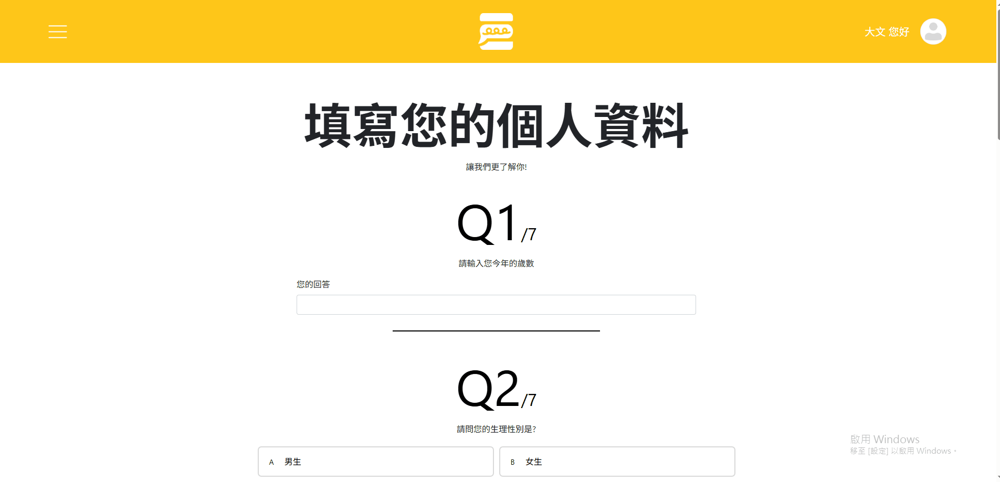
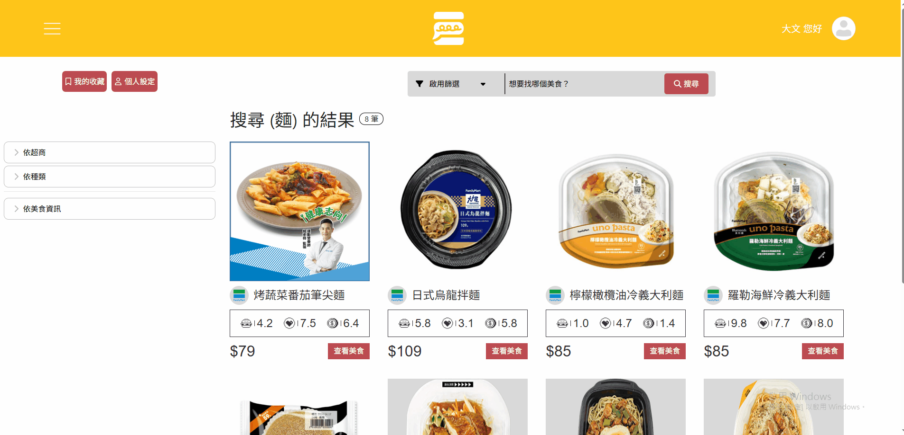

# 乞丐超人－便利商店食物評價網站

## 網站簡述
當你看見超商中琳瑯滿目的商品，卻不知道該如何挑選嗎？\
當你看見又有新品上架，卻擔心又再次踩到地雷嗎？\
那麼本網站就是專門為擁有這種煩惱的人一個解方！

本網站用於提供使用者一個網路平台，讓各位可以搜尋現有的超商產品，對每一家超商推出的商品進行詳細的評論，其中透過各式各樣的圖示、數值以及評論，給使用者簡潔明瞭的介面來了解商品的真實評價。\
(本網站使用HTML、PHP、JavaScript及css進行撰寫，使用mySQL進行資料庫串接)
(此專案由三人團隊執行，本人負責**部分網頁程式碼撰寫**、**網頁間功能交互**、**資料庫串接功能**)

## 網站功能介紹
- **主頁面**
  1. 在主頁面中，可以進行搜索功能，並且透過篩選功能(尚未完工)，篩選出想要的結果範圍。
  2. 觸碰左上側sidebar時，會呼叫出左側紅色區塊，在登入後即可使用。
  3. 右上側提供使用者註冊及登入的入口。
  

- **註冊畫面**
  1. 從主頁面點擊註冊後，進入到註冊頁面，在此處填入註冊資料。
  2. 若確認資料無誤/無衝突，即註冊成功，並進到問卷頁面，填寫額外資料。
  
  

- **登入畫面**
  1. 從主頁面點擊登入後，進入到登入頁面，在此處填入登入資料。
  2. 若確認帳密無誤，即登入成功，並回到主頁面。
  

- **進行搜尋**
  1. 在主頁面點擊輸入框後，輸入關鍵字，即可搜尋含有此關鍵字的商品。
  2. 左側篩選欄可以篩選出符合的條件，進一步出現符合需求的商品(尚未完工)。
  

- **美食評價**
  1. 點擊任意商品的**查看美食**，會進入到該商品的評價頁面
  2. 商品右側將顯示各項資訊如：價格、店家種類、平均飽足感分(漢堡圖示)、平均喜好值分(愛心圖示)、平均CP值分(金錢圖示)。
  3. 下方將展現使用者對此商品的評價，可以看到飽足感分(漢堡圖示)、喜好值分(愛心圖示)、CP值分(金錢圖示)，也支援圖片上傳。
  4. 若要進行評價，點擊下方的**我要評價**，進入到評價頁面，在此可以填寫評論、提供分數以及上傳圖片。
  5. 繳交後能夠立即看到自己的評論狀態。
  

- **個人資料更改**
  1. 點擊主頁右上角的頭像，並點擊修改個人設定，能夠進入到個人資訊頁面中。
  2. 目前支援的功能為更換頭像、更換名稱以及重新填寫問卷。
  

- **其他功能**
  1. 左側sidebar中提供兩個額外的功能。
  2. **查看我的收藏**中，能夠看見使用者收藏的商品，並且一樣能依照左側的篩選欄進行商品分類。
  3. **啟用乞丐通知**中，在勾選通知後，能夠在特定超商有優惠時刻下，向使用者發起通知。
  

- **管理員功能**
  1. 在登錄具有管理員權限的帳號後，能夠解鎖**使用者管理**以及**查看分析報表**的功能。
  2. 使用者管理目前提供簡單的管理功能，能夠刪除使用者的帳號。
  3. 查看分析報表中，目前暫時設計使用者性別比數，未來將會再拓展更多功能。
  4. 同時能夠將報表資料，以Excel或PDF檔案形式匯出，圖中以PDF作為演示。
  
